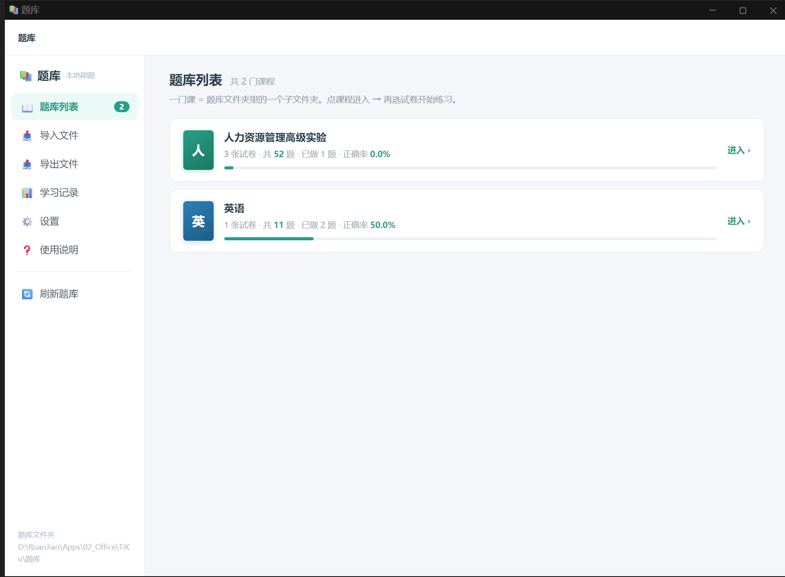

# 题库 · TiKu

> 一个**双击即用**的 Windows 本地刷题程序。
> **零依赖**（.NET Framework 4.8 是 Win10/11 自带的）、**不联网**、**不装运行库**、**不上传任何数据**。

支持从 **TXT / Word(.docx) / Markdown** 批量导入题目，**8 种题型**，自动判分、错题本、学习记录统计。



---

## ✨ 特性

| 特性 | 说明 |
| --- | --- |
| **零依赖** | 启动器只有 **21 KB**，用系统自带的 `csc.exe` 编译。不用装 Node/Python/.NET SDK |
| **不联网** | 纯本地程序。题目、答题记录全在本机，**不上传任何数据** |
| **三种格式导入** | `.txt` / `.docx` / `.md`，**UTF-8 和 GBK 自动识别**（不会乱码） |
| **Word 直接读** | 纯前端解 ZIP + 取 `word/document.xml` 正文，**不依赖任何第三方库** |
| **8 种题型** | 单选 · 多选 · 判断 · 填空 · 名词解释 · 简答 · 论述 · 案例分析 |
| **两种编写格式** | ① 试卷格式（真题/模拟卷）② 问答清单格式（笔记/背诵清单） |
| **课程 / 试卷两级** | **一门课 = 题库目录下的一个子文件夹**，一个文件 = 一张试卷 |
| **答题体验** | 选择题点一下立刻判分；主观题自己写、自己判；键盘全快捷键 |
| **错题本 + 收藏** | 答错自动进错题本；可星标收藏，支持「只练错题 / 只练收藏」 |
| **学习记录** | 总题量 / 已做 / 完成率 / 答对 / 做错 / 正确率，**全局 + 按课程 + 按试卷** 三级 |
| **题库目录可换** | 程序可以指向**任意文件夹**读题，方便配合其他工具批量产出 |
| **界面** | 用系统自带 Edge 的 `--app` 模式渲染，没有地址栏，像个原生小软件 |

---

## 🚀 快速开始

### 方式一：直接用（推荐）

1. 下载整个项目（`Code` → `Download ZIP`），解压
2. 双击 **`题库.exe`**
3. 打开自带的 **示例课程** 看格式 → 照着改

> ⚠️ **别只拷 `题库.exe`** —— 它要和 `app` 文件夹在一起。整个文件夹一起拷。

### 方式二：自己编译

```bat
build.bat
```

只要有 Windows 自带的 .NET Framework 4.8（Win10/11 默认都有）就能编译，**不需要装任何 SDK**。

手工编译命令：

```bat
%WINDIR%\Microsoft.NET\Framework64\v4.0.30319\csc.exe ^
  /target:winexe /codepage:65001 /optimize+ /out:题库.exe ^
  /r:System.Windows.Forms.dll src\launcher.cs
```

---

## 📥 怎么加题

**一门课 = 题库目录下的一个子文件夹**，一个文件 = 一张试卷：

```
题库\
├── 人力资源管理（本科）\        ← 一门课程
│   ├── 2025年1月份真题.txt      ← 一张试卷
│   ├── 2024年4月份真题.txt
│   └── 章节练习（1章）.txt
└── 线性代数（经管类）\          ← 另一门课程
    └── ...
```

两种加题方式：

- 程序里「**导入文件**」→ 选课程 → 拖文件进去（会**复制**一份，原文件不动）
- 或者直接在资源管理器里往 `题库\课程名\` 里拷 → 点「刷新题库」

---

## 📝 题目文件怎么写

程序不挑格式，**能认出就行**。两种写法都支持，混着写也行。
👇 完整规范见 **[导入格式说明.md](导入格式说明.md)**，可直接参考 **[示例题库](题库/示例课程/示例题库-格式演示.txt)**。

### ① 试卷格式（真题 / 模拟卷）

```
一、单项选择题（本大题共 25 小题）

1.在管理活动中，如果劳动成果大于劳动耗费，则具有（  ）
A.零效益
B.正效益
C.负效益
D.无效益
答案：B
解析：劳动成果大于劳动耗费，说明产出高于投入，产生的是正效益。

二、多项选择题

3.人力资源的内涵包括了劳动者的（  ）
A.体质
B.智力
C.知识
D.经验
E.技能
答案：ABCDE
解析：……
```

**题型由大标题决定**（必须用中文数字编号）：

`一、单项选择题` / `二、多项选择题` / `三、判断题` / `四、简答题` / `五、论述题` / `六、案例分析题`

### ② 问答清单格式（笔记 / 背诵清单）

```
### Q1 人力资源规划是什么？
按组织**战略目标**与**内外部环境**，预测未来人力资源的**需求**与**供给**，
制定**平衡供需**的政策与措施。

**题 1（综合应用 · 限时 40 分钟）**
某制造企业 600 人，2027 年计划扩产……请编制一份《2027 年度人力资源规划方案》。
```

**`**加粗**` 会保留**，在程序里渲染成红色粗体 —— 标关键词的习惯可以继续用。

### 识别规则（宽松，容错优先）

| 要素 | 认哪些写法 |
| --- | --- |
| 章节标题 | `一、单项选择题` …（**只认中文数字编号**） |
| 题号 | `1.` `1、` `1）` `【1】` `第1题`（**不认 `（1）`** —— 那是小题号） |
| 选项 | `A.甲` `A、甲` `A）甲` `（A）甲` `A 甲`，也支持挤在一行 |
| 答案 | `答案：B` `【答案】B` `正确答案:ACD` |
| 解析 | `解析：` `【解析】` `答案解析：` `答案与解析：` |
| 答案在文末 | 单独一行写 `参考答案`，下面按 `1.B` `2.ACD` 逐条列 |

---

## 🗂 项目结构

```
TiKu\
├── 题库.exe            ← 主程序（编译产物，21 KB）
├── build.bat           ← 一键编译
├── README.md
├── LICENSE
├── 使用说明.md          ← 用户手册（含排障）
├── 导入格式说明.md       ← 题目格式规范
├── app\                ← 界面（纯 HTML/CSS/JS，无框架无构建）
│   ├── index.html
│   ├── style.css
│   ├── app.js          ← 界面逻辑
│   └── parser.js       ← 🔑 题目解析引擎（双模式）
├── src\
│   ├── launcher.cs     ← 启动器（迷你 HTTP 服务 + 拉起浏览器）
│   └── test-parser.mjs ← 解析器自测：node src/test-parser.mjs [文件]
├── docs\images\
├── 题库\               ← 题库数据（一门课一个文件夹）
│   └── 示例课程\
└── 进度\               ← 运行时生成（答题记录 / 错题本 / 日志）
```

---

## 🔧 技术说明

| 项 | 说明 |
| --- | --- |
| 启动器 | C# / .NET Framework 4.8，`csc.exe` 编译成 `题库.exe`（WinForms 只为弹文件夹选择框） |
| 界面 | 纯 HTML/CSS/JS，用 Edge 的 `--app=URL` 打开（无地址栏），**无框架、无构建步骤** |
| 本地服务 | 自己写的迷你 HTTP 服务（`TcpListener` 手写 HTTP/1.1），**只监听 `127.0.0.1`**，端口从 45871 起找空的 |
| HTTP 接口 | `GET /api/list`（课程+试卷树）· `GET /api/read?c=&f=` · `POST /api/upload?c=&f=` · `POST /api/mkdir?c=` · `GET/POST /api/state` · `POST /api/setdir` · `POST /api/pickdir` · `GET /api/alive?t=` · `GET /api/bye?t=` |
| Word 解析 | 纯前端解 ZIP 中央目录 + `DecompressionStream('deflate-raw')` 解压 + 正则取正文 |
| 数据存储 | `进度\state.json`（答题记录 / 错题本 / 收藏 / 课程别名 / 题量缓存） |

### 🔴 三条「不能改」的设计（都是踩坑换来的）

1. **生命周期靠心跳，不靠 `Process.WaitForExit()`**
   Edge 启动会做**进程交接**，`Process.Start` 拿到的句柄可能几百毫秒就退出，`WaitForExit()` 会提前返回、把服务关掉，页面变成「无法访问」。
   → 现在：页面每 2 秒 `GET /api/alive`，关窗口时 `sendBeacon('/api/bye')`，兜底超时 150 秒。

2. **心跳必须带会话令牌（`?t=`）**
   不然上一次会话残留的旧标签页被回收时会发 `/api/bye`，**把新服务误杀**（实测：新实例起来 20 秒后被杀）。
   → 每次启动生成随机令牌，只写进本次打开的 URL；令牌对不上一律忽略。

3. **解析器的两个正则坑**
   - **章节标题只认中文数字编号**：否则 `8.简述工作分析的基本流程。` 会被当成 `三、简答题` 那种大标题**整行吞掉**；
   - **题号不认带前括号的 `（1）`**：那是案例题 / 论述题里的**小题号**，认了会把上一题的答案挂到错误的小题上。

> 💡 教训：解析器**必须拿真实材料测**。自己编的示例文件把上面两个 bug 全掩盖了（示例里恰好没有 `N.简述…` 也没有 `（N）` 行）。

---

## ❓ 常见问题

| 现象 | 处理 |
| --- | --- |
| 双击没反应 | 看 `进度\启动日志.txt` 最后几行 |
| 提示「找不到 Edge 或 Chrome」 | 装一个 Edge（Win11 自带，正常不会缺） |
| 提示「界面没能连上本地服务」 | 多半是安全软件拦了本地端口（程序只用 `127.0.0.1`） |
| 窗口白屏 | 关掉重开 |
| 进度丢了 | `进度\state.日期.bak.json` 是当天备份，改名成 `state.json` 覆盖回去 |
| 某张试卷题量显示 0 | 那张没解析出题目，对照 `导入格式说明.md` 改格式 |
| `.doc` 打不开 | **不支持老 `.doc`**，在 Word 里「另存为 → .docx」 |

更多见 **[使用说明.md](使用说明.md)**。

---

## 📄 License

[MIT](LICENSE) —— 随便用、随便改、随便分发。
